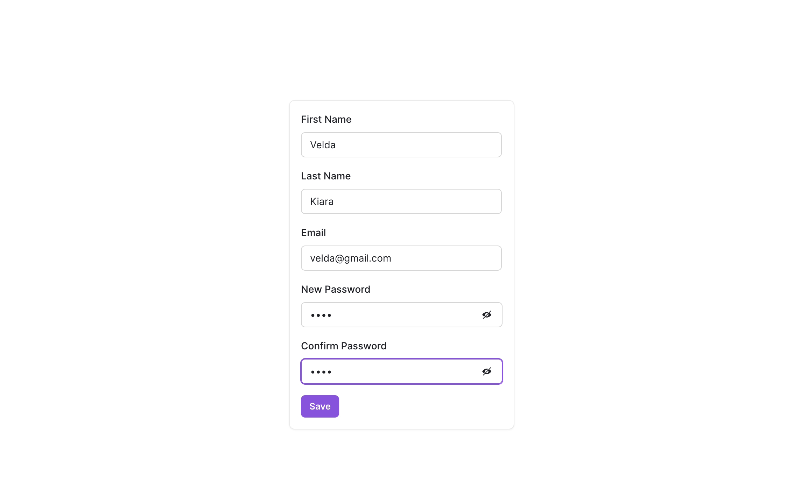

# How To Build A User Settings Page In Five Minutes
Humans inherently desire to make our mark and leave a lasting impression. Whether through scribbling on the walls of a classroom or sharing our experiences on a blog, we want to assert our presence and be remembered.

The same desire applies to software applications, where users want to control their space and data and be part of something bigger. That's why a user settings page is a crucial aspect of any software application that values its users' needs.

Going through this article, you can build a user settings page in your SAAS app in just five minutes. The settings page enables your users to take up their space in your application, shape their experience, and leave their digital footprint.

In this article, we will be using SaaS UI and NextJS.

[SAAS UI](https://saas-ui.dev/docs) is a reusable collection of React components designed to make it easier and faster to build a user interface for SAAS applications.. [NextJS](https://nextjs.org/docs/guides)is an open-source framework built on React. It allows developers to create server-side React applications easily while providing features like automatic code splitting, static site generation, etc. 

NextJS is mainly used for Saas applications because:
- Server-side rendering improves SEO and user experiences
- Automating code splitting allows users only to download the code they need, which improves performance
- Static site generation allows code to be served from a CDN for even faster performance
- Built-in API routes make it easy to build APIs without setting up a separate server
- Good developer experience provides features out of the box, such as hot module replacement, automatic code reloading, and improve productivity

### Project Setup
We are using [NextJS](https://nextjs.org/docs/guides) and [SAAS UI](https://saas-ui.dev/docs)

a. Install [NextJS](https://nextjs.org/docs/guides) which comes with dependencies like: react, react-dom, next, eslint and eslint-config-next.
```
npx create-next-app@latest my-site
```
b. Install [SAAS UI](https://saas-ui.dev/docs)
```
npm i @saas-ui/react @chakra-ui/react @emotion/react@^11 @emotion/styled@^11 framer-motion@^6
```
### Provider SetUp
In your `_app.js` , insert the following code:
```
import '@/styles/globals.css'
import { SaasProvider } from '@saas-ui/react'

export default function App({ Component, pageProps }) {
  return (
    <SaasProvider>
        <Component {...pageProps} />
    </SaasProvider>
  )
}
```
By default, NextJS comes with some prefilled CSS files, which are imported as a global stylesheet from the `@/styles` and directly applied to all components of the applications. Import the `SaasProvider` component from the `@saas-ui/react` package that provides a theme and other UI-related configurations to the application. The SaasProvider component wraps any part of the application that requires access to these configurations.
We have the default App function rendered for every page in the application. The function takes two props:
- `Component`: is the current page that is being rendered 
- `pageProps`: are the initial props passed to the page during server-side rendering.
The App function returns the SaasProvider component, with the Component and pageProps passed as props to the Component. Props will ensure that the SaasProvider and its related configurations are available on all pages in the application.

### Link Component
We will configure a `linkCompnent` to make Saas UI link work with the NextJS router. This is mainly required for NextJS 13+.
We wil add the `link component` in the `_app.js` file. 

```
import NextLink from 'next/link'
import { SaasProvider, LinkProps  } from '@saas-ui/react'

const Link = (props) => {
  return <NextLink {...props} legacyBehavior />
}
export default function App({ Component, pageProps }) {
  return (
    <SaasProvider linkComponent={Link}>
        <Component {...pageProps} />
    </SaasProvider>
  )
}
```
In the above code, `NextLink` is a component from the NextJS library that handles client-side navigation. It is imported and used as a base component for the custom Link component. This code is imported and used as a base component for the custom Link component. The Link component defined is a custom wrapper around the NextLink component. It passes all its props to NextLink and an additional prop called `legacyBehavior`. This is a custom prop used by the application to modify the behavior of links. The Link component is also passed to the SaasProvider as a prop, so all links in the application use the custom Link component.

### Creating a User Settings Form

The form component is built on top of the React Hook Form following the WAI(Web Accessibility Initiative) specifications to make sure forms created with it are inclusive and accessible to all users.

A little background, the React Hook form helps developers build forms in React with less code and performance optimization. This provides a seamless API use to manage states and validations. WAI is an international group that works to improve the accessibility of the web by setting guidelines for creating accessible content.
The `Form` component provides particular props to customize the behavior of the form. 

The props include:
- `onSubmit` prop that specifies the function called when the `Form` is submitted.
- `required` prop specifies a field that cannot be empty
- `children` prop specifies content of the form and can be a render prop or a ReactNode
- `context` prop passes context to the form
- `criteriaMode` prop for validation criteria applied
- `defaultValues` specifies default values
- `delayError` delays showing errors until the user stops typing
- `formRef` is the reference to the HTMLFormElement
- `mode` specifies the validation mode
- `onChange` triggered when fields change
- `onError` triggered when there are errors for validation
- `ref` is  a reference to the `useFormReturn` hook
- `resolver` is the resolver function for the form schema.
- `reValidateMode` specifies when to re-validate the form.
- `schema` specifies the form schema and only supports the Yup schema at the moment
- `shouldFocusError` specifies if the form should focus on the first error
-  `shouldUnregister` specifies  if the fields should be unregistered when they are removed
- `shouldUseNativeValidation` specifies if to use the native browser validation

In your `index,js` file add the following code to set up the form and functionalities.
```
import Head from 'next/head'
import { Inter } from 'next/font/google'
import styles from '@/styles/Home.module.css'
import {
  Form,
  FormLayout,
  Field,
  SubmitButton,
  Card,
  CardBody
} from '@saas-ui/react'
import usePasswordMatch from "./pwd";


const inter = Inter({ subsets: ['latin'] })

export default function Home() {
  const {
    isMatch,
    handlePasswordChange,
    handleConfirmPasswordChange,
  } = usePasswordMatch();

  const handleSubmit = (event) => {

    // console.log(event)
  
    // Handle form submission here
  };
  return (
    <>
      <Head>
        <title>User Page</title>
        <meta name="description" content="Generated by create next app" />
        <meta name="viewport" content="width=device-width, initial-scale=1" />
        <link rel="icon" href="/favicon.ico" />
      </Head>
      <main>
        <div className={styles.flex_center}> 
        <Card maxW="400px" margin="25px auto">
        <CardBody>
        <Form onSubmit={handleSubmit} 
        defaultValues={{
          firstName: 'Velda',
          lastName: 'Kiara',
          email:'velda@gmail.com'
        }} 
        >
              <FormLayout>
                <Field name="firstName" label="First Name" width="20.5em" rules={{ required: true}} />
                <Field name="lastName" label="Last Name" width="20.5em" rules={{ required: true }} />
                  <Field
                    name="email"
                    label="Email"
                    type="email" 
                    rules={{ required: true }}
                    width="20.5em" 
                  />
                <Field type="password" name="password" label=" New Password" width="18em" rules={{ required: true, type: 'password' }} onChange={handlePasswordChange} />
                <Field type="password" name="confirmPassword" label="Confirm Password" width="18em" rules={{ required: true, type: 'password' }} onChange={handleConfirmPasswordChange}/>
                {!isMatch && <p className={styles.highlight}>Passwords do not match</p>}
                  <SubmitButton disableIfInvalid > Save </SubmitButton> 
              </FormLayout>
        </Form>
        </CardBody>
        </Card>
        </div>   
      </main>
    </>
  )
}

```
The head component from the `next/head` library defines the document's head section. It sets the title, description, viewport meta tag, and favicon. The `Inter` component from the `next/font/google` library leads the `inter` font from Google Fonts. It specifies the "Latin" subset of the font to be loaded. The styles component is imported from the CSS module "@/styles/Home.module.css."

The form-related components used for this project imported from `@saas-ui/react` library include `Form, FormLayout, Field, SubmitButton, Card and CardBody`. The components define the behavior and layout of the form.

`usePasswordMatch` function is imported locally from a module called `pwd`. The function returns an object with the three properties: 
- `isMatch`, 
- `handlePasswordChange`, and 
- `handleConfirmPasswordChange`

The above properties validate whether the passwords entered match. You can leave this pending at the moment. We will get to it in a few.
The `Home` function is the main Component of the module. It renders the form and handles its submission. The `defaultValues` prop of the `Form` component sets the default values because this page assumes the user has already signed in to the Saas Application. The `field` components define the individual input fields of the form. Each has a `name, label, type, and rules` prop. They also have `width` to ensure they are at an appropriate size. The `type` prop specifies the `input type`, which can be `text, email, or password`. The `rules` prop specifies the validation rules for the fields. The `onChange` prop specifies a callback function whenever the user changes the values of the input field. The `SubmitButton` defines the behavior of the form. The `disableIfInvalid` prop disables the button if input fields are invalid. The `isMatch` property is used to render a message to the user if the new password and confirm password entered do not match. The `handleSubmit` function is called when the user submits the form. It currently logs the event object to the console. However, the function can be modified to save the data in the database of the Saas application.

### Password Validation

Create a `pwd.js` file and add the following code:
```
import { useState } from "react";

const usePasswordMatch = () => {
  const [password, setPassword] = useState("");
  const [confirmPassword, setConfirmPassword] = useState("");
  const [isMatch, setIsMatch] = useState(true);

  const handlePasswordChange = e => {
    setPassword(e.target.value);
    setIsMatch(e.target.value === confirmPassword);
  };

  const handleConfirmPasswordChange = (
    e) => {
    setConfirmPassword(e.target.value);
    setIsMatch(e.target.value === password);
  };

  return { password, confirmPassword, isMatch, handlePasswordChange, handleConfirmPasswordChange };
};

export default usePasswordMatch;
```
The code above creates a custom React hook named `usePasswordMatch`  that handles password and confirm password inputs to check whether they match. The `useState` hook is used to set and manage the state of the ` password, confirmPassword and isMatch`. Once the starts to type in the password input field, `handlePasswordChange` is called to update the password state by checking if it matches the value of the password. If it does match, it returns True else, False. Same case with the confirm password input field with the `handleConfirmPasswordChange` function. The hook returns an object that contains `password, confirmPassword, isMatch, handlePasswordChange, and handleConfirmPasswordChange`. 

The last bit is styling. Since It's a card, we want it to be centralized to have a presentable layout.
In the files for `global.css` add the following code:
```
html, body 
{
  height: 100%;
  padding: 0;
  margin: 0;
}
```
The HTML and body elements height is 100% of the viewport height, Which means the entire browser window height. It removes any default padding or margin applied by the browser. 

In the `home.module.css` add the following code:
```
flex_center{
  display: flex;
  align-content: center;
  justify-content: center;
  flex-direction: column;
  height: 100vh;
}
.highlight{
  color: red;
  font-style: oblique;
}
```
The `flex-center`{the `div` that holds the card} class sets the flex container with items stacked vertically, centered horizontally, and vertically within its container. The `highlight` {the text displayed when passwords do not match} sets the color to red, implying an error message.

The code is now complete, it should like this 

The Github Code can be found [here](https://github.com/VeldaKiara/user-page)

Through this code you should have built a fully functioning user setings page using Saas UI and NextJS.

May your keyboard be swift, your bugs be few, and your fun meter be off the charts as you code away!


