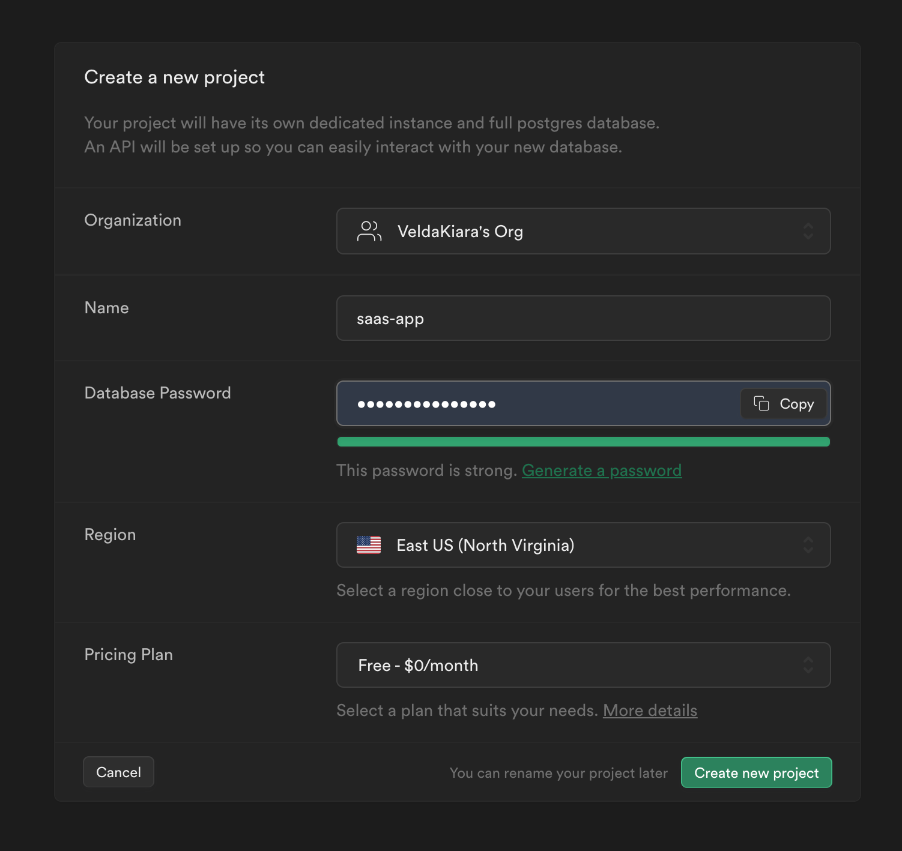
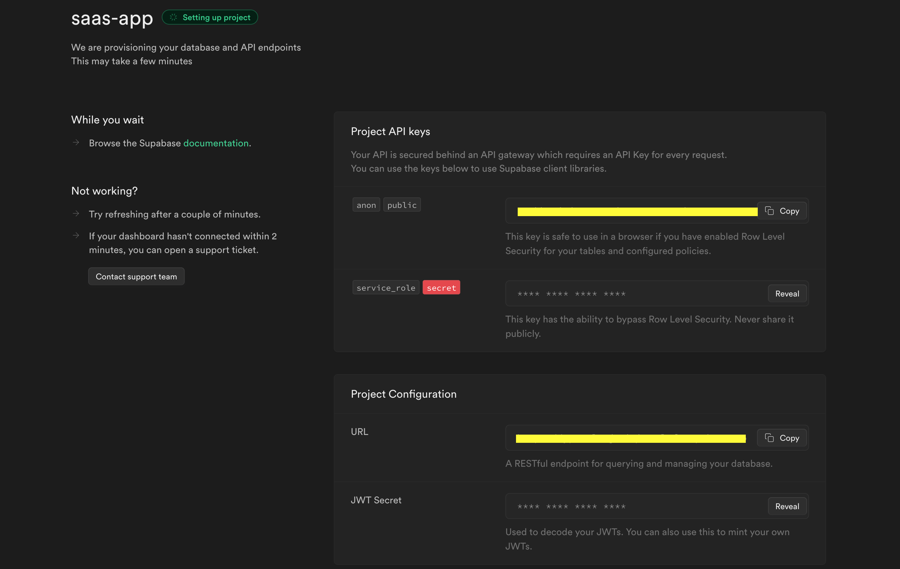
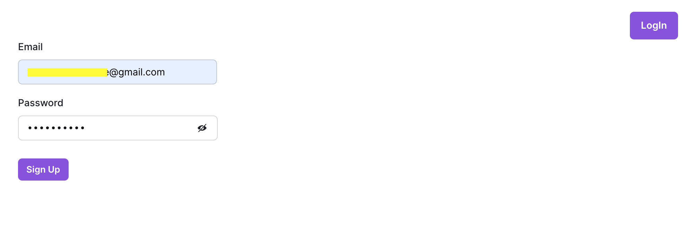
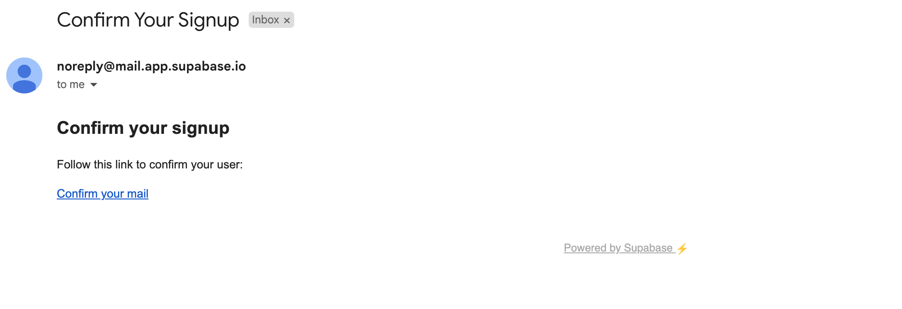
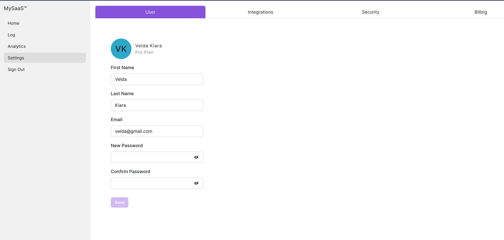
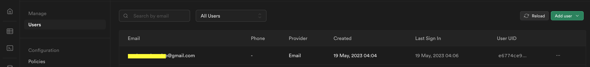
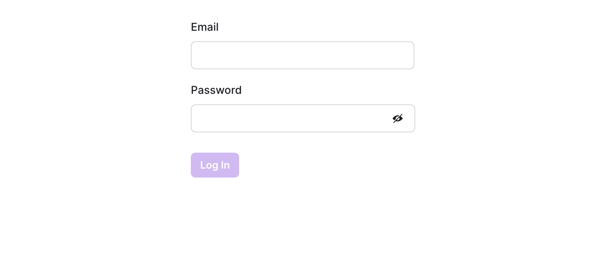
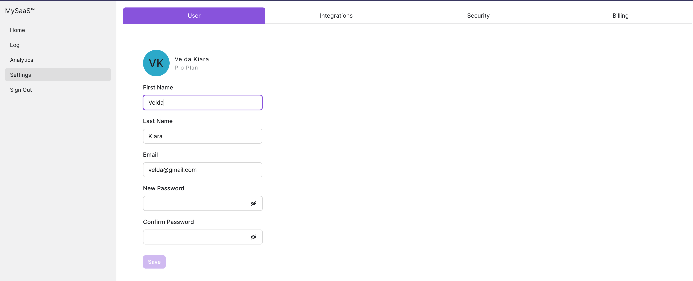

# Authentication Made Easy: Setting Up Supabase Auth for Your SaaS

In SaaS (Software as a Service) applications, authentication is essential to secure the user's private information. Authentication involves verifying the user's identity and granting them appropriate access to the application's resources.

Authentication is necessary for the following reasons:
- maintaining data security
- protecting user privacy
- prevent unauthorized access
- identity theft and data breaches

Through this article, we will go through how to implement authentication using Supabase and Next JS. This article is also follow up on [how-to-build-a-user-settings-page](https://medium.com/javascript-in-plain-english/how-to-build-a-user-settings-page-in-five-minutes-6d1ba7f233c4)

Supabase is an open-source software that provides a database and a serverless backend service to software applications. It simplifies development by providing tools and services that perform backend tasks such as data storage, real-time updates, authentication, and more. Supabase is scalable, and its ease of use makes it an excellent choice for building web and mobile applications.

## Why Choose Supabase

Supabase provides the following:

1. Real-time updates
Supabase uses PostgreSQL's built-in capabilities to provide real-time data. Your application will listen for changes in the database and receive updates as they occur, allowing you to build dynamic and reactive user experiences.

2. Authentication and authorization
Supabase provides built-in authentication and authorization features, ensuring your application is secure while managing user accounts easily. Authentication methods include but are not limited to email/password, social login, and other third-party providers like Google.

3. Database funtionality
PostgreSQL is a robust relational database that Supabase uses to leverage its querying capabilities like data modeling and transaction support in Supabases simplified API and real-time functionality 

4. Serverless infrastructure
Supabase handles server-side infrastructure through automatic scaling and high availability, ensuring the application can withstand  increased traffic and still be reliable

5. Open-source and extensible
Being open source means you can contribute to its development and extend its functionality to other tools and services that you use to suit your stack needs

## Configuration and Set Up

### Create a New Project on Supabase

Use this [link](https://app.supabase.com/sign-in) to sign up and create a Project as shown below



Credentials such as the projects URL and API keys will be generated once the project is created. PS: Keep your project API keys secret.

 

Install `Supabase` to the `Next JS` project already created.
```
npm i @supabase/supabase-js
```

Create a `.env.local` file in the root project and add your `Project URL` and `Project Key`. Include the file in the `.gitignore` file to prevent pushing the private keys to Github.
```
NEXT_PUBLIC_SUPABASE_URL= // paste your project url here
NEXT_PUBLIC_SUPABASE_ANON_KEY= // paste your supabase anon key here
```
Create a `Utils` folder at the root of the project and add a `Supabase.js` file. In the `Supabase.js` file.

```
// supabase.js
import { createClient } from "@supabase/supabase-js";

const supabaseUrl = process.env.NEXT_PUBLIC_SUPABASE_URL;
const supabaseKey = process.env.NEXT_PUBLIC_SUPABASE_ANON_KEY;

export const supabase = createClient(supabaseUrl, supabaseKey);
```
`createClient` is a function  used to create a Supabase client object that can be used to interact with the Supabase services. The process.env object allows accessing environment variables in Node.js applications. We can now call and use the Supabase client anywhere in this project.

We already have a home page under the `UserSettings.jsx` with the following code:
```
import { Box, Flex } from "@chakra-ui/react";
import { Persona, Form, FormLayout, Field, SubmitButton } from "@saas-ui/react";
import usePasswordMatch from "@/hooks/pwd";
import {  useEffect } from "react";
import { useRouter } from 'next/router';
import { supabase } from "@/utils/supabase";


export const UserSettings = () => {
  const router = useRouter();

  useEffect (() => {

  supabase.auth.onAuthStateChange((event, session) => {
    
    if (event==="SIGNED_OUT"){
        router.push('/LogIn')
    } 
  })
  
  },[router]) 
  const {
    password,
    confirmPassword,
    isMatch,
    handlePasswordChange,
    handleConfirmPasswordChange,
  } = usePasswordMatch();
 
  const handleSubmit = (event) => {
    console.log(event);
  };

  return (
    <>
      <Box padding="8">
        <Flex alignItems="start" marginBlock="4">
          <Persona
            name="Velda Kiara"
            secondaryLabel="Pro Plan"
            size="lg"
            letterSpacing={"0.78px"}
          />
        </Flex>

        <Form
          onSubmit={handleSubmit}
          defaultValues={{
            firstName: "Velda",
            lastName: "Kiara",
            email: "velda@gmail.com",
          }}
        >
          <FormLayout>
            <Field
              backgroundColor={"white"}
              textColor={"black"}
              name="firstName"
              label="First Name"
              width="20.5em"
              rules={{ required: true }}
            />
            <Field
              backgroundColor={"white"}
              textColor={"black"}
              name="lastName"
              label="Last Name"
              width="20.5em"
              rules={{ required: true }}
            />
            <Field
              backgroundColor={"white"}
              textColor={"black"}
              name="email"
              label="Email"
              type="email"
              rules={{ required: true }}
              width="20.5em"
            />
            <Field
              fontFamily={"mono"}
              backgroundColor={"white"}
              textColor={"black"}
              type="password"
              name="password"
              label=" New Password"
              value={password}
              width="18em"
              rules={{ required: true }}
              onChange={handlePasswordChange}
            />
            <Field
              fontFamily={"mono"}
              backgroundColor={"white"}
              textColor={"black"}
              type="password"
              name="confirmPassword"
              label="Confirm Password"
              value={confirmPassword}
              width="18em"
              rules={{ required: true }}
              onChange={handleConfirmPasswordChange}
            />
            {!isMatch && (
              <p className="highlight">Passwords do not match</p>
            )}
            <SubmitButton marginBlockStart="10px" disableIfInvalid>
              Save
            </SubmitButton>
          </FormLayout>
        </Form>
      </Box>
    </>
  );
};

```
A few changes were introduced, we added the `useRouter` hook from Next.Js to provde access to the router instance and the  `useEffect hook`, an `onAuthStateChange event` is a listener for the `supabase.auth` object that changes the authentication state if the user clicks on Sign Out. I redirects the user to the Sign Up page using `router`.

I created two more pages `LogIn.js` and `SignUp.js `.  The `SignUp.js ` file serves as a registeration form, and the `LogIn.js` is for users who are already registered. 

In the `SignUp.js` file add the code below
```
import { supabase } from "@/utils/supabase";
import { Box, Center, Button} from "@chakra-ui/react";
import { Form, FormLayout, Field, SubmitButton } from "@saas-ui/react";
import Link from "next/link";
import {  useEffect } from "react";
import { useRouter } from 'next/router';


export default function SignUp() {
  const router = useRouter();

  useEffect (() => {

  supabase.auth.onAuthStateChange((event, session) => {
    
    if (session){
        router.push('/')
    }
  })
  
  },[router]) 
  const handleSubmit = async ({ email, password }) => {
    
    try {
      const { data, error } = await supabase.auth.signUp({
        email,
        password,
      });
      console.log(data, error);
    } catch (error) {
      console.log(error);
    }
  };
  return (
    <div > 
    <Box padding="8" position="relative" > 
      <div style={{ display: "flex", justifyContent: "flex-end" }}>
        <Button colorScheme="purple" size="md">
          <Link href="/LogIn">LogIn</Link>
        </Button>
      </div>

      <Center>
        <Form onSubmit={handleSubmit}>
          <FormLayout>
            <Field
              backgroundColor={"white"}
              textColor={"black"}
              name="email"
              label="Email"
              type="email"
              rules={{ required: true }}
              width="20.5em"
            />
            <Field
              fontFamily={"mono"}
              backgroundColor={"white"}
              textColor={"black"}
              type="password"
              name="password"
              label=" Password"
          
              width="18em"
              rules={{ required: true }}
            />

            <SubmitButton
              marginBlockStart="10px"
              disableIfInvalid
            >
              Sign Up
            </SubmitButton>
          </FormLayout>
        </Form>
      </Center>
    </Box>
    </div>
  );
}

```
I previously used `ChakraUi` which is a dependency in this case, and needs to be imported. Since we are using `Supabase` for authentication its also a dependency. The Sign Up is used to register new users who are accessing the application for the first time. Once the user is registered, the user is redirected to the home page. The `useEffect` hook is used to listen to the `onAuthStateChange` event from `supabase.auth`. It redirects the user to the home page if they are already signed in.The `handleSubmit` function is an asynchronous function that handles the form submission. It uses `supabase.auth.signUp` to create a new user account with the provided email and password.

a. User-signup
 

b. User gets an email from supabase for verification
 

c. Once verified, the user is taken to the home page
 

d. Supabase dashboard users who have signed in and are verified
 

The `LogIn.js`  code include components to log into the application, for users who already signed up.
 

In the `LogIn` file add the following code:
```
import { Box, Center } from "@chakra-ui/react";
import {Form, FormLayout, Field, SubmitButton } from "@saas-ui/react";
import { supabase } from "@/utils/supabase";
import {  useEffect } from "react";
import { useRouter } from 'next/router';

export default function LogIn() {

  const router = useRouter();

  useEffect (() => {

  supabase.auth.onAuthStateChange((event, session) => {
    
    if (session){
        router.push('/')
    }
  })
  
  },[router]) 
  const handleSubmit  = async({email, password}) => {
    try {
        const { data, error } = await supabase.auth.signInWithPassword({
            email,
            password,
          })
          if (data && data.user){
            router.push('/')
          }
          
    } catch (error) {
        console.log(error)
    }
    

  };
 

return(
  
  <Box padding="8" position='relative'>
  <Center>
  <Form
    onSubmit={handleSubmit}
  >
    <FormLayout>
   
     
      <Field
        backgroundColor={"white"}
        textColor={"black"}
        name="email"
        
        label="Email"
        type="email"
        rules={{ required: true }}
        width="20.5em"
       
      />
      <Field
        fontFamily={"mono"}
        backgroundColor={"white"}
        textColor={"black"}
        type="password"
        name="password"
        label=" Password"
        width="18em"
        rules={{ required: true }}
       
      />
     
      <SubmitButton 
      marginBlockStart="10px" disableIfInvalid>
        Log In
      </SubmitButton>
    </FormLayout>
  </Form>
  </Center>
</Box>


  );
}

```
The file is almost similar to the `Sign Up` form with a few differences. In the `LogIn` file `supabase` uses `supabase.auth.signInWithPassword ` to authenticate the user with the provided email and password, if they match the user is taken to the home page. 

In a case where the user wants to sign out of the current session, the sidebar has a `NavItem` with `SignOut`. `SignOut` removes the user from the current session to log them out and removes all elements in the localstorage

```
/* SaaS UI - SideBar Imports */
import { Sidebar, SidebarSection, NavItem } from "@saas-ui/sidebar";
/* SaaS UI & Chakra UI Imports */
import { Spacer } from "@chakra-ui/react";
// import SignUp from "@/pages/SignUp";
import Link from 'next/link';
import { supabase } from "@/utils/supabase";
import { useRouter } from 'next/router';
export const MySidebar = () => {
  const router = useRouter();
  const handleSignOut = async () => {
    
    const { error } = await supabase.auth.signOut();
    
    if (error) {
      console.error('Sign-out error:', error.message);
    } else {
      // Redirect the user to the desired page after successful sign-out
      router.push('/SignUp'); // Replace with your desired page
     
    }
  };
  return (
    <>
      <Sidebar breakpoints={{ base: false }} backgroundColor="gray.100">
        <SidebarSection direction="row">
          <Link href="/SignUp"> MySaaS™ </Link>
          <Spacer />
        </SidebarSection>
        <SidebarSection aria-label="Main " textColor="white">
          <NavItem href="/"> Home </NavItem>
          <NavItem>Log</NavItem>
          <NavItem>Analytics</NavItem>
          <NavItem isActive>Settings</NavItem>
          <NavItem onClick={handleSignOut}>Sign Out</NavItem>
          
        </SidebarSection>
      </Sidebar>
    </>
  );
};
```
 

In conclusion, Supabase offers a simplified and efficient solution for implementing authentication in SaaS applications. By following the steps outlined in this guide, you can easily integrate Supabase Auth into your Next.js application, setting a strong foundation for secure user authentication. By leveraging Next.js and Supabase, you can create robust sign-up and login pages that seamlessly interact with Supabase's authentication features. Remember to consult the comprehensive [Supabase documentation ](https://supabase.com/docs/guides)for advanced features and further details on integrating authentication into your SaaS application. With Supabase, you can confidently build a secure and scalable authentication system, empowering your users while focusing on delivering your application's unique value.
